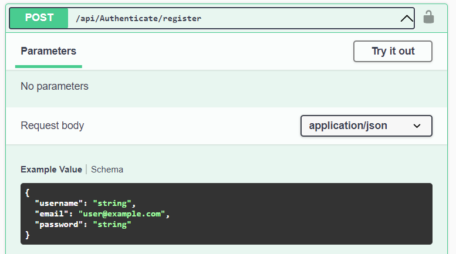
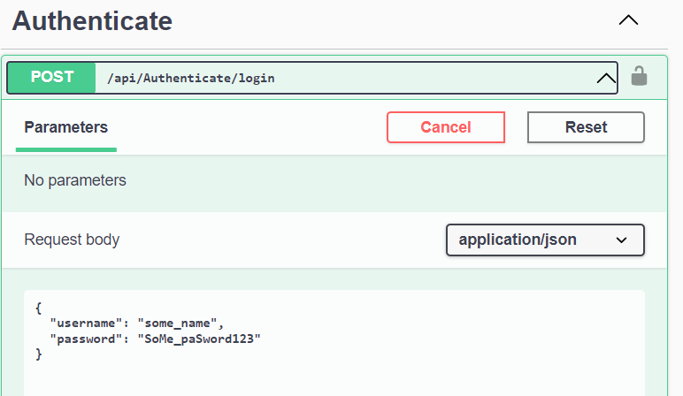
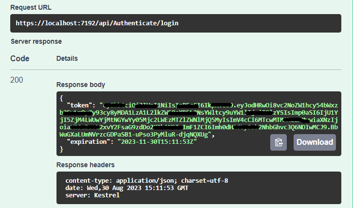
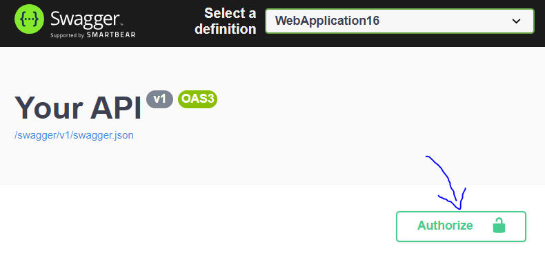
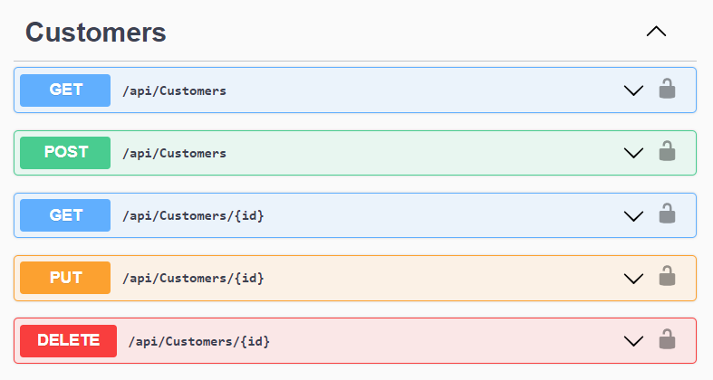

# CMPG323-Project2-33509735
Link to API on Azure:
"https://ecopowerprojectdev.azurewebsites.net/index.html" or "https://ecopowerprojectdev.azurewebsites.net/swagger/v1/swagger.json"

## Background
EcoPower Logistics sells a wide range of parts and components essential for installing, functioning, and optimising solar energy systems. These parts are designed to harness and convert solar energy into usable electricity.
EcoPower Logistics specialises in managing and optimising the intricate processes involved in moving goods, encompassing warehousing and transportation, from the initial source to the final destination based on individual customer requirements. 
Given the ever-growing reliance on logistics to sustain businesses and drive economic activities, EcoPower Logistics recognise the imperative of uninterrupted operations and increasingly leverages technology to adapt and enhance services. 

## Problem Statment
APIs offer many benefits, from fostering business agility to improving the overall customer experience. By seamlessly integrating API solutions into their operations, logistics companies can unlock new opportunities for growth, efficiency, and service excellence.
Ecopower Logistics require a Representational State Transger (REST) API, which uses CRUD (Create, Read, Update, Delete) methods. Use .NET Core API to develop the REST API for EcoPower Logistics to enhance their business performance.

## How to use API
The API is hosted on AZURE web portal. the following steps will give a guide on how to use the API hosted in AZURE web portal.
1. Go to "https://ecopowerprojectdev.azurewebsites.net/index.html" or "https://ecopowerprojectdev.azurewebsites.net/swagger/v1/swagger.json"
2. Register an account with username and password (Your password must contain 8 or more character, full capital and small capital letters, symbols and numbers for example "aBdDcC12!@").

3. Login to your account using your created credentials.

4. You will be given a token copy the token.

5. Click on the lock icon at the top right to get authorization. Enter "Bearer {token}).

6. You can now use any of the given methods.

## How to use Methods
After obtaining authorization you can easily select any method and click on the try it out button.
### Get
Get all the data from the selected table.
### Get {id}
Get only the selected data from the table based around the id provided (number values: "0")
### Get {customerId}
Get the order based on a provide customer id (number values: "0")
### Post
Add any value to a table, you will be required to provide all the correct credentails.
### PUT
Update any value of table, you will be required to proved all the correct credentails.
### Delete
Delete any value of the table, if it excists.

## Refrences
1. Microsoft. 2023. Tutorial: Create a web API with ASP.NET Core. https://learn.microsoft.com/en-us/aspnet/core/tutorials/first-web-api?view=aspnetcore-6.0&tabs=visual-studio Date of access: 30 Aug. 2023.
2. Microsoft. 2023. Create a web API with ASP.NET Core controllers. https://learn.microsoft.com/en-us/training/modules/build-web-api-aspnet-core/ Date of access: 30 Aug. 2023.
3. Microsoft. 2022. ASP.NET Core web API documentation with Swagger / OpenAPI. https://learn.microsoft.com/en-us/aspnet/core/tutorials/web-api-help-pages-using-swagger?view=aspnetcore-3.1 Date of access: 30 Aug. 2023.
4. Microsoft. 2022. ASP.NET Core web API documentation with Swagger / OpenAPI. https://learn.microsoft.com/en-us/aspnet/core/tutorials/web-api-help-pages-using-swagger?view=aspnetcore-3.1 Date of access: 30 Aug. 2023.
5. Pro Code Guide. 2021. Entity Framework Core in ASP.NET Core 3.1 – Getting Started. https://procodeguide.com/programming/entity-framework-core-in-asp-net-core/ Date of access: 30 Aug. 2023.
6. The JPanda. 2020. [Python] Automating ASP.NET Core Web API Creation That Communicates With Your Database in 60 Seconds or Less. https://thejpanda.com/2020/08/10/python-automating-asp-net-core-web-api-creation-that-communicates-with-your-database-in-60-seconds-or-less/ Date of access: 30 Aug. 2023.
7. Microsoft. 2022. Publish an ASP.NET Core web API to Azure API Management with Visual Studio. https://learn.microsoft.com/en-us/aspnet/core/tutorials/publish-to-azure-api-management-using-vs?view=aspnetcore-6.0 Date of access: 30 Aug. 2023.
8. Microsoft. 2023. Handle errors in ASP.NET Core web APIs https://learn.microsoft.com/en-us/aspnet/core/web-api/handle-errors?view=aspnetcore-6.0 Date of access: 30 Aug. 2023.
9. Microsoft. 2023. .NET Hot Reload support for ASP.NET Core https://learn.microsoft.com/en-us/aspnet/core/test/hot-reload?view=aspnetcore-6.0 Date of access: 30 Aug. 2023.
10. Microsoft. 2023. ASP.NET Core Best Practices https://learn.microsoft.com/en-us/aspnet/core/fundamentals/best-practices?view=aspnetcore-6.0 Date of access: 30 Aug. 2023.

